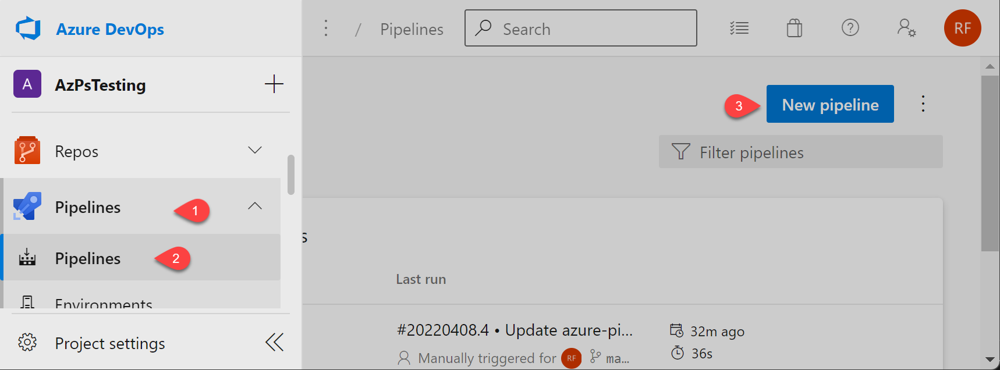
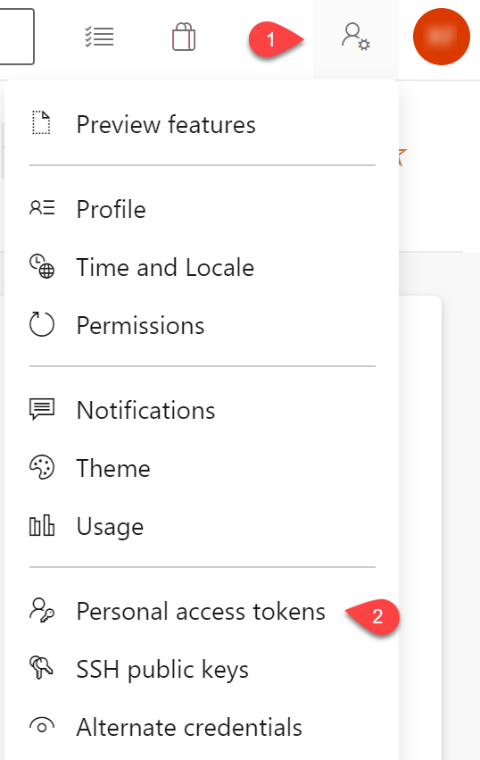
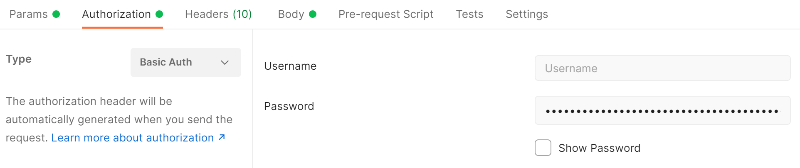
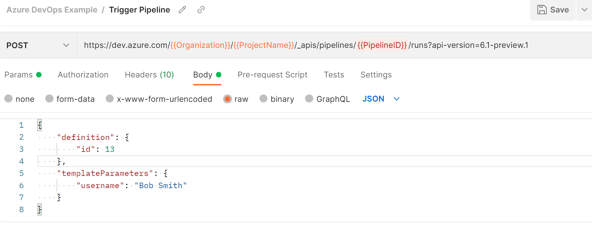

# Running powershell scripts in azure pipelines

Azure pipelines can be use to run as a host.

## Create the Pipeline



1. Create a new pipeline
   1. Select where the code is located (Azure Repo Git) > Select the repository
   2. Select Starter Pipeline
2. replace the yaml task

```ymal
trigger:
- none

pr: none 

pool:
  name: Azure Pipelines

parameters:
  - name: username
    type: string

steps:
- task: PowerShell@2
  displayName: 'PowerShell Script'
  inputs:
    targetType: filePath
    filePath: ./helloWorldPram.ps1
    arguments: '-name "${{parameters.username}}"'

```

## External Trigger for Pipelines

Trigger from an external system to run a powershell script

### Trigger Via Rest API

#### Generate personal access token

The personal access token (PAT) is used to authenticate when making the rest api call.

1. Open the Azure DevOps Project > Personal access token
   1. 
2. Create a personal access token with permissions for build/release pipelines

#### Rest API Call

the pipeline id can be found in the url within the browser when viewing the pipeline.

```http
https://dev.azure.com/{{Organization}}/{{ProjectName}}/_apis/pipelines/{{PipelineID}}/runs?api-version=6.1-preview.1
```

```json
{
    "definition": {
        "id": 13
    },
    "templateParameters": {
        "username": "Bob Smith"
    }
}
```

Refrence: [Azure DevOps RestAPI](https://docs.microsoft.com/rest/api/azure/devops/pipelines/runs/run-pipeline?view=azure-devops-rest-6.0)

#### Make the call from postman

Under the Authentication tab set the auth type to Basic Auth and using the personal access token as the password. (Leaving the username blank.)


Under the body tab set the type to raw and json. Paste the body of the request.

