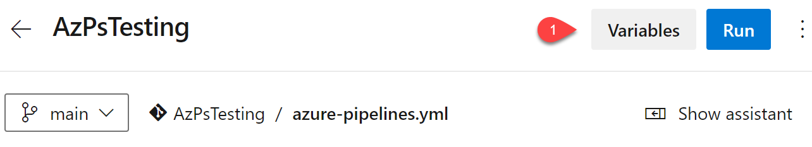

# Running powershell scripts in azure pipelines

Azure pipelines can be use to run as a host.

## Create the Pipeline

1. Create a new pipeline
   
   1. Select where the code is located (Azure Repo Git) > Select the repository
   2. Select Starter Pipeline
   3. Set any env variables
      1. 
2. replace the yaml task

```ymal
trigger:
- main
pool:
  name: Azure Pipelines
steps:
- task: PowerShell@2
  displayName: 'PowerShell Script'
  inputs:
    targetType: filePath
    filePath: ./helloWorldPram.ps1
    arguments: '-name ${env:NAME}'
```

## External Trigger for Pipelines

### Trigger Via Rest API

### Trigger Via Logic Apps
