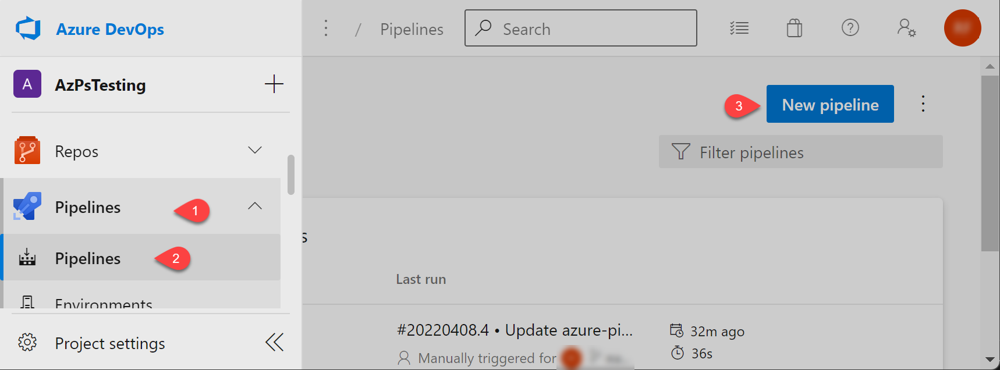
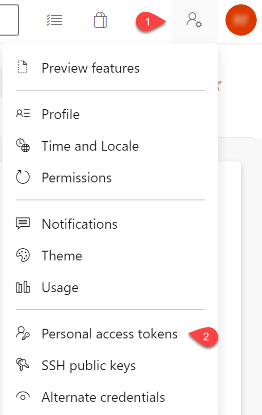
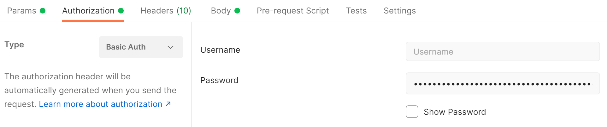
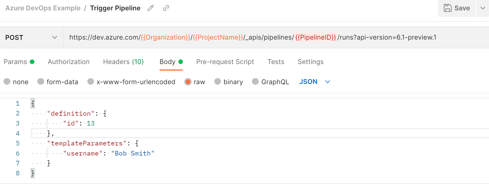

# Running powershell scripts in azure pipelines

Using azure pipelines to host a powershell script to be triggered via an external system.

## Create the Pipeline



1. Keep the powershell script in the azure devops project repo
2. Under pipelines select new pipeline
   1. Select where the code is located (Azure Repo Git) > Select the repository
   2. Select Starter Pipeline
3. replace the yaml task

```ymal
trigger:
- none

pr: none 

pool:
  name: Azure Pipelines

parameters:
  - name: username
    type: string

steps:
- task: PowerShell@2
  displayName: 'PowerShell Script'
  inputs:
    targetType: filePath
    filePath: ./helloWorldPram.ps1
    arguments: '-name "${{parameters.username}}"'

```

## Trigger Pipeline Via Rest API

Trigger an azure pipeline from an external system to run a powershell script.

### Generate personal access token

The personal access token (PAT) is used to authenticate when making the rest api call.

1. Open the Azure DevOps Project > Personal access token
   1. 
2. Create a personal access token with permissions for build/release pipelines

### Rest API Call

Rest API needs the id of the pipeline. The Pipeline ID can be found by navigating to the pipeline in the Azure DevOps portal and looking at the URL. Replace the PipelineId, ProjectName, and OrganizationName below.

```http
https://dev.azure.com/{{Organization}}/{{ProjectName}}/_apis/pipelines/{{PipelineID}}/runs?api-version=6.1-preview.1
```

```json
{
    "definition": {
        "id": 13
    },
    "templateParameters": {
        "username": "Bob Smith"
    }
}
```

Azure API Reference: [RestAPI](https://docs.microsoft.com/rest/api/azure/devops/pipelines/runs/run-pipeline?view=azure-devops-rest-6.0)

### Make the call from postman

Postman can be used to test your setup. After importing the postman configuration (under the pipelines folder). Navigate to the Authentication tab and set the auth type to "Basic Auth". Paste the personal access token as the password and leave the username blank.


Add the request body under the "Body" tab, set the type to raw and content type to json.


Postman export of rest calls are under the pipelines folder.
